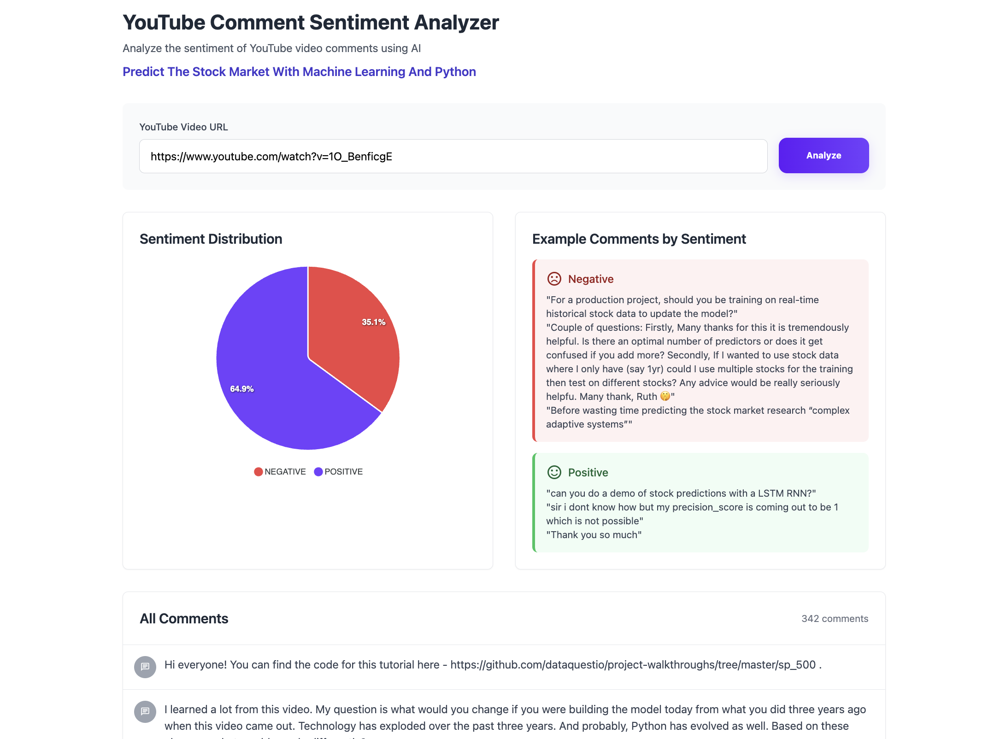

# YouTube Comment Sentiment Analyzer

Analyze the sentiment of YouTube video comments using a custom-trained machine learning model!

## Features
- Paste a YouTube video URL and analyze its comments
- Sentiment breakdown (positive/negative)
- Example comments by sentiment
- View all fetched comments
- Beautiful, modern UI

## Demo
 <!-- Add a screenshot if you have one -->

## Tech Stack
- **Frontend:** HTML, CSS (Tailwind), JavaScript, ApexCharts
- **Backend:** Python Flask
- **ML Model:** scikit-learn (SVM or similar), pickled as `sentiment_classifier.pkl`
- **APIs:** YouTube Data API v3

## Getting Started

### 1. Clone the Repository
```sh
git clone https://github.com/yourusername/VibeCheckML.git
cd youtube-sentiment-analyzer
```

### 2. Install Python Dependencies
```sh
pip install flask flask-cors requests scikit-learn
```

### 3. Add Your Model Files
- Place `sentiment_classifier.pkl` and `vectorizer.pkl` in the project root.

### 4. Set Your YouTube API Key
Create a `.env` file in the project root and add your YouTube API key:
```sh
# Create .env file
echo "YOUTUBE_API_KEY=your_youtube_api_key_here" > .env
```
Then edit the `.env` file and replace `your_youtube_api_key_here` with your actual YouTube API key.

### 5. Run the Backend
```sh
python3 app.py
```
- The backend will run on `http://localhost:5050`

### 6. Run the Frontend
You can open `public/index.html` directly in your browser, or serve it with:
```sh
cd public
python3 -m http.server 8000
```
- Visit `http://localhost:8000` in your browser.

### 7. Command-Line Interface (CLI)
You can also predict the sentiment of any text using the CLI tool:

```sh
python vibecheck_cli.py "Your text to analyze here"
```

Example:
```sh
python vibecheck_cli.py "This video was amazing!"
```
Output:
```
Sentiment: POSITIVE
```

## Environment Variables
The following environment variables should be set in a `.env` file in the project root:
- `YOUTUBE_API_KEY`: Your YouTube Data API v3 key

## Folder Structure
```
VibeCheckML/
  ├── app.js
  ├── app.py
  ├── data/
  │   ├── Books_small_10000.json
  │   └── Books_small.json
  ├── main.py
  ├── package-lock.json
  ├── package.json
  ├── public/
  │   └── index.html
  ├── README.md
  ├── sentiment_classifier.pkl
  ├── vectorizer.pkl
  └── vibecheck_cli.py
```